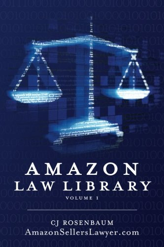

> "The judge's wig, however, is more than a mere relic of antiquated professional dress. Functionally it has close connections with the dancing masks of savages. It transforms the wearer into another "being". — Homo Ludens, Johan Huizinga 1944

> TAKE THE UNIVERSE AND GRIND IT DOWN TO THE FINEST POWDER AND SIEVE IT THROUGH THE FINEST SIEVE AND THEN SHOW ME ONE ATOM OF JUSTICE, ONE MOLECULE OF MERCY. AND YET—Death waved a hand. AND YET YOU ACT AS IF THERE IS SOME IDEAL ORDER IN THE WORLD, AS IF THERE IS SOME...SOME RIGHTNESS IN THE UNIVERSE BY WHICH IT MAY BE JUDGED.
>
> "Yes, but people have got to believe that, or what's the point—"
>
> MY POINT EXACTLY."
>
> ― Terry Pratchett, Hogfather

## Preamble

We're going to take a scenic hike through human behaviour, the basis of law and ordered society, why puppies are trainable, and then come back to Solidity code. Please be patient.

The book Homo Ludens from which we took our opening quotation holds that human social behaviour is primarily a matter of play. Life or death criminal trials are role-plays with an execution. Wrestling is fighting tamed to a bear hug. Political debates stem from the ancient games of riddles.

Games require a delineated space, participants and rules for their roles. All our legal system is a sacred game. We consider sacred games to be those where the players accept the outcome to have significant binding consequences after play has ended. Deadly Games, such as capital penalty trials or duelling, being the most extreme form where a life may be ended, and this accepted by the society in which the game was situated.

"Crypto" as it is currently played is a terrible game. The cost of playing is high. The rules are opaque. Different participants perceive them unequally. Outcomes are chaotic, especially when intersecting with IRL law enforcement and personal morality. We will consider the structural factors that led to this, and then begin to look at how better games might be constructed.

## Thesis

1. The play instinct is the basis for our sense of fairness and cooperation.
2. Games are formalised or bounded play
3. Sacralisation both inwards, in the acceptance of dharma, or externally through embedding within wider social institutions, leads to consequences being imposed on players.
4. Sacralisation is independent of the game format and dependent on the players' own social context.

### Which Way Virtual Man?

Consider these two VR helmets.

Deadly. Play.

[Normal Oculus]
[Lucky Palmer's You Die in Real Life Art Project]

Wear the first, lose points. Wear the second, lose heads.

Consider these two men.

| Place           | Mango Markets Crypto DAO                                                                                                                                                                                                                                                                                                                                                           | Eve Online MMORPG                                                                                                                                                                                                                                                                                     |
| --------------- | ---------------------------------------------------------------------------------------------------------------------------------------------------------------------------------------------------------------------------------------------------------------------------------------------------------------------------------------------------------------------------------- | ---------------------------------------------------------------------------------------------------------------------------------------------------------------------------------------------------------------------------------------------------------------------------------------------------- |
| Person          | Avraham Eisenberg                                                                                                                                                                                                                                                                                                                                                                  | "The Judge"                                                                                                                                                                                                                                                                                          |
| Pic             | Pic                                                                                                                                                                                                                                                                                                                                                                                | Pic                                                                                                                                                                                                                                                                                                  |
| Action          | Complex price manipulation within the allowed technical parametres of the system, but socially and legally condemned.                                                                                                                                                                                                                                                              | Simple theft using a position of trust.                                                                                                                                                                                                                                                              |
| Context         | Mango Markets is a decentralised cross-margin trading platform built on the Solana blockchain. Mango delivers fully on-chain margin trading, borrow & lending markets, and perpetual futures in one decentralised application.                                                                                                                                                     | With over 7,000 solar systems and nearly 20 years of rich player-created history, join this storied universe and play free to experience everything from immense PvP or PvE battles to mining, exploration, and industry.                                                                            |
| Rationalisation | "I believe all of our actions were legal open market actions, using the protocol as designed, even if the development team did not fully anticipate all the consequences of setting parametres the way they are."                                                                                                                                                                  | "Payback. Vengeance. Revenge. Real Rains of Castamere type vengeance. It let me participate in a way, in a war that I missed, and let me strike a blow for my friends. Headshotting the great betrayer."                                                                                             |
| Consequences    | Arrested and jailed in a federal prison in Puerto Rico, transported to NYC on parallel criminal charges.  Avraham was convicted of one count of commodities fraud and one count of commodities manipulation, both of which carry a maximum penalty of 10 years in prison; and one count of wire fraud, which carries a maximum punishment of 20 years. He awaits sentencing. | "I've got plenty of money to fly whatever I want for as long as I want, I don't have to worry about that. Now I can play the metagame or I can go around and fly in faction warfare space. I can do whatever I want."  Leader of **betrayed** organisation banned for life by game governance. |
| Local currency  | Mango = $0.04                                                                                                                                                                                                                                                                                                                                                                      | ISK = $0.13                                                                                                                                                                                                                                                                                          |

In both the cases above, the conduct was simply a man sitting in front of a screen, pressing buttons within a complex computer model to make Number Go Up. Both Avraham and "The Judge" acted within the constraints of the game as they saw them. The difference in consequence was imposed on them by how their games were framed by others.

ISK currency and Caldari Titans are not real. Marinade Staked SOLs apparently were.

It is worth noting that a committee of the British Parliament wrote a report proposing to regulate cryptocurrency markets as merely gambling dens on the grounds there were no underlying rights or obligations exchanged. The considered opinion of a large part of one of the world's oldest legislatures would have agreed with Avraham that his conduct was "just playing the game".

Other similar incidents were the Index Finance hack, where the affected project used the threat of legal coercion under criminal law, and the original DAO Hack where the underlying crypto-currency forked itself into a version where the hack had never occurred. (Being permission-less, the original crypto-currency still exists, but trades far below the value of the "corrected" chain.)

To re-iterate, Johan Huizinga, quoted at the head of this paper, held that human social behaviour is rooted in play. When we go to school, trade in the market, put a man on trial for his life, step on a tennis court – we're acting out the same essential instincts as four year olds in a pillow fort. This essay presumes that this explains a lot about society. We might talk about law and society, but these are simply the games we are force socialised into as adults with rent to pay.

Sometimes we strap the shaped charges to the computer screen. Sometimes we don't. Sometimes we punish aggressive price strategies with the US justice system. Sometimes we don't. Sometimes we rewrite history in the system so that a number change we don't like appears never to have happened. Sometimes we don't.

The aim of the paper is not to assert what "crypto law" ought to be, or how it should be enforced, but to hold the notion of a self-contained crypto law as nonsensical, and in doing so point forward towards less futile avenues.

We will start by considering crypto in its natural, feral, or Dark Forest state, and how this is both unviable and does not allow for meaningful property rights. We draw parallels to other emergent digital legal orders (and their abuses); look to how these new games have been sanctified with force; and then return to crypto-space to consider how such play spaces might be structured. Lastly, we consider the technical options available to construct such play spaces or legal orders, and the first steps that could be taken towards them.

## Crypto is A Dark Forest

> "The monsters had devoured us." – Dan Robinson, Ethereum is a Dark Forest

> "I accidentally killed it" – @devops199

To paraphrase the famous Chinese author Cixin Liu, the public blockchain is a dark forest. Every wallet an armed hunter stalking through the trees without sound. Everywhere in the forest stealthy hunters like him. If he finds other life—another hunter, an angel or a demon, a delicate infant or a tottering old man, a fairy or a demigod—there's only one thing he can do: open fire and rug them. In this forest, hell is other private key signers.

And this dynamic flows *by construction*. This is a direct consequence of being an open and neutral environment. It is not a bug. It is a feature. It is nature.

Crypto Law is a chimera. It is entirely normal at a large crypto event to hear someone advocate that although phishing [deceiving a person into a transaction they did not intend] is a crime, using a smart contract in an unexpected way never can be. Or that "DeFi Hacks" should be prosecuted globally under US laws, but insider dealing by KOLs [Key Opinion Leaders] is an accepted part of token markets and fraud hunters (especially @ZackBTC :) ) "harassing" people over this normal behaviour are disingenuous and lazy.

> "Why should man expect his prayer for mercy to be heard by What is above him when he shows no mercy to what is under him?"  —Pierre Troubetzkoy

### Property is a Game Item

Western notions of legality often presume the existence of property as a prior. Other legal traditions are more careful to distinguish between possessions, like a hairpin, and legal property which exists by virtue of titles in law enforced by some order. Maybe that of the King. Maybe simply the accepted common law (or play rules) of the people around them.

Indeed, Katharina Pistor's thesis for The Code of Capital is that the transformation of intangibles and natural commons to legally enclosed capital was, and is, a key driver of capitalist accumulation. This being true of everything from the original enclosure acts, through to the invention of "Intellectual Property", and the carve out of modern global financial derivatives away from national contract law into private arbitration.

Steven Cheung's analysis of property rights considers property rights and titles to emerge from contractual negotiation with the sovereign power. An approach that is well supported by the material variations in land law between nations, as opposed to the "natural" laws of simple theft or assault.

Property is a legal relation that allows an interest in a thing you do not hold in your hand. It is a product of social memory and legitimacy. Total amnesia will alienate you from your home, it could be rented or mortgaged, but never your watch or phone.

In this paper I hold that raw crypto in its natural Dark Forest state can only be a place of possession, not of property. Property is a game item. It emerges within ordered games and not by isolated action. We might play for property. We merely hold possessions.

### No-one wants to buy a toaster in the Dark Forest

Raw crypto is a bad game to play. Returning to our crypto conference enjoyors. They hold that exploiting coding defects for profit is criminal. The people involved are to be physically restrained and punished by state violence. This action of state violence is justice to them. They also hold that disingenuous statements about token values or terms are a normal practice. It will not surprise the reader the author has met people with precisely the opposite opinion, who hold that Code is Law and anything a smart contract can be made to do is a priori legitimate. Lying, however, is wrong!

The difference between these people is that the former are well networked members of the crypto community with good contacts in the meme-coin space. And the latter sit at home writing DeFi code and looking at byte-code documentation. To the first, social risks are legible and accepted, but technical tampering is outside the game. Smart contract hacks are dishonourable acts, an unfairness, an injustice. To the second, the reverse is true; technical combat is with honour, an arena open to all comers. Deceit is without that honour. Mere lying by manipulators. Off-chain and out of bounds.

One might also argue that raw crypto is modern day Chess Boxing. Both risks must be considered as accepted by participants. There is place for neither the technically weak nor the naive.

[Chess boxing picture]

But ask yourself if this is a thing you would accept in daily life.

People will not accept being punched in the face walking into a Poker tournament. People will not accept their eBay toaster being *legitimately* diverted to Bali because of an Internet Explorer or Ethereum bug.

GAME DEFECT: Unclear boundaries.

### No-one wants to buy a toaster in the Dark Room

> You get quick money, it's beautiful, there's sunshine, but at the end of the day, you find out it's all a masquerade, baby. It's not what it seems. – Wyclef Jean

Imagine a city where you show a new face in every building. Your self in the marketplace is not your self at the bank, or the train station.

No carry over, no community. In every venue trust is established anew. The coffee-shops and water-coolers of the internet, Crypto Twitter, and the thousands of Telegram groups, try to provide this. But these are external crutches. The economic efficiencies blockchain aficionados sought need commitment to be legible on the ledger.

And MEW is but pure chaos.

GAME DEFECT: Fragmented context across interactions.

Note that this is not to say persistent and meaningful identities are not possible in blockchain environments, see Vitalik's Soul Bound Tokens or the large body of work on Verifiable Credentials, merely that they are naturally absent.

### Round Tripping the Sewer

People are only truly rewarded in the real world. Nice homes, big cars, willing life (or just sex) partners, a bag of roast chestnuts while walking the bank of the Tagus in December, an iPad Pro with a Magic Keyboard cover.

[Maslow's Hierarchy of Needs]

Financial wealth is meaningless. We can't eat bank deposits or Bitcoin. This means on-chain transaction costs are meaningless. What matters is the full round-trip cost of taking real wealth, exchanging it for magic internet coins, and then in turn, exchanging those magic coins for consumption items or capital assets.

Within the broad crypto eco-system, we have transaction costs commensurate with placing bank notes into an open sewer, and cleaning them off again. The ultimate buyer of a crypto asset needs to do work to discover if what they have been paid is legitimately sourced or tainted. To a degree this can be mitigated by staying within crypto, the Bitcoin community is keen on this, or by transacting in very large amounts to amortise the cost of compliance.

Analytics tools, so called Fedware, can provide point solutions to solve compliance problems, but these tools are expensive and their result is unpredictable. It is not possible to predict whether a future transaction will be within the "envelope" that a tool allows. It's not even possible to tell if a transaction will lead to jail by PDF if your assets commingle a criminal's.

Economics has a concept of No Good Deals, where profitable trades fail to happen due to overheads or lack of certainty. Raw crypto largely means No Good Deals for otherwise viable commercial transactions. The margins in an efficient market are outweighed by the costs raw crypto introduces.

[Some illustration of the No Good Deals principle]

Even selling an e-book for crypto requires the seller to know some information for VAT and sales taxes. These kinds of issues eliminate Vitalik's long-tail of blockchain use-case from the environment of raw crypto.

But the casino remains. Ponzi games have very large expected returns and risks. These dwarf raw crypto's uncertainty and remain. The hardy cockroaches of economics :)

### Games within Games within Games

(Matryoshka doll illustration)
(Dumb Doll as Crypto)

## This has been before

> Governments of the Industrial World, you weary giants of flesh and steel, I come from Cyberspace, the new home of Mind. On behalf of the future, I ask you of the past to leave us alone. You are not welcome among us. You have no sovereignty where we gather.
> — [John Perry Barlow](https://en.wikipedia.org/wiki/John_Perry_Barlow "John Perry Barlow"), "A Declaration of the Independence of Cyberspace", February 8, 1996

There have been many attempts to build digital worlds that can represent a full-reset on outside norms and space without rules or enforcement. In this section my thinking draws heavily on Vili Lehdonvirta's excellent book [Cloud Empires](https://www.researchgate.net/publication/369515157_Book_Review_Cloud_Empires_How_Digital_Platforms_Are_Overtaking_the_State_and_How_We_Can_Regain_Control), which is a fantastic look at digital platforms and their governance. It is important to remember that we have been here before.

Originally eBay existed simply as a posting board for auctions, and the founder refused to intervene in any disputes. Strangers simply emailed each other to arrange completion after the auction closed. And on a small scale this did in fact work.

However by 1998, The National Consumers League received five times more complaints about online auctions than any other online commerce. This led to series of experiments, and innovations, each often designed to fit flaws in the earlier system. For example, reciprocal positive reviews, led to eBay removing feedback on buyers entirely, however this change then led to buyers blackmailing sellers since sellers could no longer punish them. Etc.

After further scandals involving food safety, art authenticity, and other issues, eBay developed an elaborate private legal code, and now handles more commerical disputes within its systems than most countries courts.

> It’s amazing how eBay has created its own universe of rules, a sort of specific legal system. It’s impressive. And their rules overwrite existing legislation.… With eBay you can’t negotiate, because they set the rules. – Furniature Seller, "Working for the Algorithm"

Although eBay has now settled into a stable marketplace, the corporation is still sensitive enough to criticism that stalked and harassed the writers of the EcommerceBytes newsletter.

> "eBay was charged criminally with two counts of stalking through interstate travel, two counts of stalking through electronic communications services, one count of witness tampering, and one count of obstruction of justice, and has entered into a deferred prosecution agreement." – US Department of Justice, 2024

The online labour market Upwork experienced a similar evolution, culminating in the introduction of a [global mimimum wage of $3/hour](https://support.upwork.com/hc/en-us/articles/211062988-Minimum-hourly-and-fixed-price-rates-on-Upwork) in 2014! Having created a population of worker whom Upwork (then oDesk) effectively taxed, the company went on to start providing certification, and even free training, to its "citizens".

Amazon has actually given rise to a [$95 hardback law reference \[Amazon Law, vol. 1\]](https://www.amazon.com/Amazon-Law-Library-CJ-Rosenbaum/dp/0692762221/) focusing solely on its [internal disputes system](https://www.theverge.com/2018/12/19/18140799/amazon-marketplace-scams-seller-court-appeal-reinstatement).

It is worth remembering that the world Amazon has crafted for itself is based in its ability to withhold market access, block funds, and impound stock in its care. Amazon is still subject to the operation of the normal courts of the countries in which it operates. Which court and what laws ultimately apply are relatively clear-cut. Items and customers exist in definite locations. Ultimately, normal commercial law can prevail.

Silk Road, on the other hand, did not rely on the State for its ultimate enforcement. It [stood explicitly outside](https://aeon.co/essays/why-the-hidden-internet-can-t-be-a-libertarian-paradise) of the violence of the State. Not only did the Silk Road suffer from similar feedback collusion issues to eBay, without the framework of law, darker dynamic emerged.

Dread Pirate Roberts started wanting to use ‘economic theory as a means to abolish the use of coercion and aggression amongst mankind’, and build an ‘economic simulation’ for a world without the ‘systemic use of force’. By the end, he paid a total of $650k for 'justified' killings to eliminate threats to the marketplace. (Mercifully, both the threat and the killers appear to have simply been a scam against Dread Pirate Roberts himself.)

Here we can see a clear progression of...

1. Early informal utopianism where trust is brought in from a wider society.
2. Structuring of formal games around behaviour, feedback, escrow mechanisms, etc, as the initial trust breaks down.
3. Bargaining with existing monopolies of violence to efficiently handle residual offending.

The Web2 business wave might be best understood as the construction of private jurisdictions enabled by new technology. A political act in the domains opened by new communications technology. Not the development of any novel technology per se.

Nevertheless, the first stages are always attempts a rule and norm formation within an emergent order. In old Anglo-saxon law, a market or manor would be established, and then petition the monarch [for a franchise](https://papers.ssrn.com/sol3/papers.cfm?abstract_id=936314) to create a court to enforce its laws, which could vary wildly across the country according to local custom.

It should be noted that this does still happen. Investment and trade treaties often [create arbitration courts](https://en.wikipedia.org/wiki/Investor–state_dispute_settlement) that bind the signatory nations. International financial markets have had increasing success in shifting complex disputes into [specialist arbitration](https://primefinancedisputes.org/page/about-us), rather than international courts. And the US [MERS mortgage registration system](https://www.nytimes.com/2011/03/06/business/06mers.html) has become systemic enough that after the Financial Crisis, the laws were changed to facilitate it, rather than the other way around.   

We can start to see this in crypto token markets. Once the main liquidity for trading as literally a Reddit forum /r/tokenmarket where participants bargained informally. Now it is Uniswap where participants are entirely anonymous to one another as all choices to defect have been removed by the game mechanisms itself.

We should note that Uniswap has happened without the need to petition (or call in executions on) anyone. That should be a sign that for all the froth and speculation of the last ten years, something has in fact been achieved.

#### Thoughts on the Formalisation of Emergent Orders

## Some Conclusions

1. Property rights in any form are ex-ante the notion of a game with boundaries and rules. Otherwise we'd simply take things whenever an "owner" left them.
2. Games are layered over each other. A game of monopoly is a narrowing of society's existing "being a person" game. Even an environment as serious as a courtroom requires basic human norms to pre-exist, ex. people speak in turn, the defendant does not physically bite the witnesses, and so on.
3. Transaction costs are game resolution costs. Therefore disorder is always more expensive. Disorder is not the same as lawless or stateless.
4. The correct place to look for ways to bring in order is in games of the same medium.
5. Games need to be internally coherent, eg. exploit free, but not necessarily dox'd.

We cannot function socially or economically in Hot Anarchy. Most of us prefer to avoid even the mental cruelty of [Cold Anarchy](https://medium.com/@ANNEARCHY/cold-anarchy-by-nick-land-f3a245ea4596).

## Why play? Why games?

We play games to order our social relations. This is what games are. Play predates order. Order predates justice. And justice necessarily predates formal enforcement.

Do not confuse the police or the SEC with order itself. Iceland [functioned perfectly fine for 300 years](http://www.daviddfriedman.com/Academic/Iceland/Iceland.html) with 1 official post and an intricate system of blood money payments. It was not even a particularly violent society.

Society formalises into Law Enforcement. Law Enforcement does not create society.

## What Issues Must Public Ledgers Solve To Play Good Games?

We want to escape Hot Anarchy into an order, or set of intersecting orders, that are *habitable* for commerce, politics, and the establishment of common truths. Focusing on the economics first, let us consider the affordances we need in our systems.

### Spaces with Bounded Rules

We need to know when we (or our assets) are in a space. Will our actions be subject to US jurisdiction? Are there any rules at all? Are we within the bounds of a particular game?

Spaces where actions have real consequences are going to need to be gated by consent and Terms of Use. Perhaps signing a message, or being forced to watch a video. Or like a real life border, a flag and vibe shift 🙂

These spaces need to be able to overlap and build on each other.

### Varying Supervision

We need to be able to have relatively free spaces in which social norms, or play patterns, can emerge, ex. Reddit marketplaces; and tight spaces with limited permitted actions and rigorously enforced rules, ex. Amazon Marketplace.

### Lamination (or binding to existing enforcement)

To be enforceable by state violence, the signals or digital artefacts of our space need to be 

## Light Cones and Covenants

GameFi === Scaling === Governance

Lego / Slots

### Gates

### Rails

### Realms

### Jurisdiction

### (Occlusion)

### Implementations
#### Token Lenses / Vaults Standards
#### Roll-ups
#### Recursive Covenants
#### Chains / L2s

### Models of Emulation
#### Dark Forest
#### Eve Online
#### Corda
#### AML Chain
#### Whitelists
#### Chainalysis

X  umm KYC

Settling the Crypto Void

> "When a system is far from equilibrium small islands of coherence in a sea of chaos have the capacity to lift the entire system to a higher order.” ~ Ilya Prigogine, Chemist and Nobel Laureate"

Welcome to the Pit: A Safe Space

